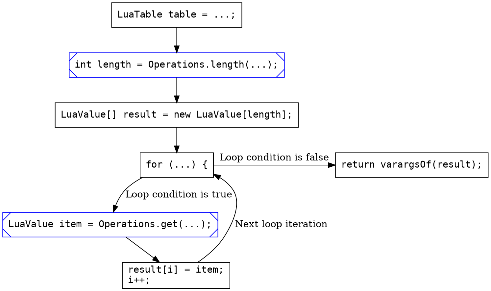

One of the projects I work on as part of CC: Tweaked is [Cobalt], our Lua runtime. While originally a fork of LuaJ, it's
now very much its own thing, having undergone many large refactors over the years. I've written a little bit about
Cobalt in the past (see [here][tweaking] and [here][concat]), so do check those posts if you're interested!

[Cobalt]: https://github.com/SquidDev/Cobalt "Cobalt on GitHub"
[tweaking]: https://squiddev.cc/2019/03/08/tweaking-cc-tweaked.html "Tweaking the internals of CC: Tweaked"
[concat]: https://squiddev.cc/2020/08/22/cobalt-concat.html "Optimising Lua's string concatenation"

One of Lua's cooler features is its support for coroutines. Coroutines are a mechanism for writing concurrent
programs[^concurrent] - each coroutine has its own "thread" of execution, and control is passed between them with the
`coroutine.yield` and `coroutine.resume` functions.

[^concurrent]: Here I'm meaning concurrency to have the ability to have overlapped exeuction of multiple tasks. This is
    different to parallelism, where those tasks are executed simultaneously (i.e. on multiple cores).

<details><summary>Example code using a coroutine. Feel free to skip if you're already familiar!</summary>

```lua
local function counter(name)
  return function()
    for i = 1, 3 do
      print(name, i)
      coroutine.yield() -- Pass control back to the resumer
    end
  end
end

-- Create two coroutines
local cos = {
  coroutine.create(counter("counter 1")),
  coroutine.create(counter("counter 2")),
}

while #cos > 0 do
  -- Resume each coroutine
  for i = #cos, 1, -1 do
    assert(coroutine.resume(cos[i]))
    if coroutine.status(cos[i]) == "dead" then table.remove(cos, i) end
  end
end
```

This example code creates two counters, and then runs the two concurrently, printing the following output:

```lua
counter 2	1
counter 1	1
counter 2	2
counter 1	2
counter 2	3
counter 1	3
```

</details>

# Implementing coroutines
While coroutines are an incredibly neat feature, they do cause problems when implementing a Lua VM. Unlike languages
like C# or Javascript, where asynchronous functions must be explicitly defined with the `async` keyword, any Lua
function is allowed to yield[^colour]. This means that almost all of the Lua VM must support yielding[^anywhere],
including:

 1. The Lua interpreter (duh!).
 2. Debug hooks (such as "on call" and "on instruction").
 3. Any library function (a function written in Java/C rather than Lua) which calls back into Lua. This includes
    anything which calls a function directly (i.e. `table.sort` or `string.gsub`), but also anything which might invoke
    a metamethod. This includes anything which indexes into a table, so is surprisingly common!

[colour]: https://journal.stuffwithstuff.com/2015/02/01/what-color-is-your-function/ "What Color is Your Function?"

[^colour]: It's probably worth mentioning the classic [What Color is your Function?][colour] blog post. I personally
    don't agree with its conclusions - after all, function colours are just effect types right?! - but it is an
    interesting read!

[^anywhere]: Well it doesn't _have_ to. PUC Lua doesn't allow yielding from within many library functions, throwing the
    somewhat infamous "attempt to yield across a C-call boundary" error.

    However, one of the requirements of Cobalt is that we should be able to pause (and then resume) the execution of
    the Lua runtime at any point. But there's little difference between pausing the runtime and pausing just one
    coroutine, and so it makes sense to support both.

While most of this blog post will be spent on talking about how we implement yielding in library functions, let's talk
about how to implement coroutines in the first place! The JVM doesn’t have built-in support for coroutines[^loom], so
we're going to build everything from scratch. There’s several ways we might go about this:

[^loom]: Well, yet. Project Loom (which adds support for green threads) is on the horizon. However, eventually we'd be
    like to persist and restore the current Lua VM, and so we're better off rolling our own mechanism here anyway.

 1. Create a native thread for each coroutine, with locks to ensure only one thread runs at once.

    This is what LuaJ does. While it's simple to implement, it can be very resource intensive. Coroutines are expected
    to be cheap, so programs may chose to run dozens or even hundreds at once. On larger ComputerCraft servers such as
    SwitchCraft, we saw several thousand threads being used just for coroutines.

 2. Use Continuation Passing Style (CPS).

    If you're familiar with effect handlers, then I'm sure you've seen an implementation of coroutines using shallow
    handlers. CPS is a common implementation strategy for effects, and so this is a fairly obvious choice.

    For readers who don't get excited by programming language research, CPS is just a fancy word for callbacks. While
    NodeJS is the infamous example of using callbacks to implement asynchronous control flow, many other async models
    such as JS's `Promise` and .NET's `Task`[^netasync] are still heavily callback-based under the hood.

    Unfortunately, the Java runtime is not very amenable callback-heavy code. Each callback must be allocated on the
    heap, and the lack of tail calls necessitates the use of trampolines.

[^netasync]: .NET is a little more complex then that. I can heartily recommend [this blog post][net_async], which goes
    into the history behind their current implementation, and some neat tricks they use to avoid
    allocations. Unfortunately for us, Java doesn't support value types, so there's very little we can use there :(.

[net_async]: https://devblogs.microsoft.com/dotnet/how-async-await-really-works/ "How Async/Await Really Works in C#"

 3. Throw an exception.

    When a coroutine yields, throw an exception, unwinding the current stack. In this case, any information on the stack
    is discarded, and so state should be stored on an external object as the function executes.

    This is (mostly)[^lua_callback] what Lua does. The state of Lua's functions is already stored on the Lua stack, so
    discarding the native stack doesn't really matter. However, this doesn't work very well for C functions which call
    back into Lua, limiting the places one can yield.

[^lua_callback]: The public API _is_ implemented in terms of callbacks, see [the Lua
  manual](https://www.lua.org/manual/5.4/manual.html#4.5).

Cobalt uses a slightly odd mixture of 1 and 3. If every function on the call stack supports being resumed (this includes
every Lua function, and some library functions), then we throw an exception to unwind the stack. If this is not the
case, then we pause the current thread and switch execution over to a new one.

While it is a little cursed, it has also served us very well for the past four years. In some ways, it allows us to get
the best of both worlds. Most coroutines won't have any Java functions on the stack, and so can yield by
unwinding. However, if we do have a Java function on the stack, we're still able to yield as one might expect.

But yeah, it's also super cursed, so let's try something different.

# State machines the boring way
The main reason we need all this extra threading machinery is that most library functions don't support being unwound
and resumed. If we want to remove the need for extra threads, we'll need to find a way to make library functions
resumable.

Let's take a simple function, `table.unpack`. This takes a table as an argument (i.e. `{ 1, 2, 3 }`), and "unpacks"
them, returning them as multiple values. This is implemented in Java a little bit like this:

```java
public static Varargs unpack(LuaState state, Varargs args) {
  LuaTable table = args.arg(1).checkTable();

  int length = Operations.length(state, table);
  LuaValue[] result = new LuaValue[length];
  for (int i = 0; i < length; i++) {
    LuaValue item = Operations.get(state, table, i + 1);
    result[i] = value;
  }

  return varargsOf(result);
}
```

There's two places where this function may yield:

 - When finding the table's length (`Operations.length`), as it may invoke the `__len` metamethod.
 - When indexing into the table (`Operations.get`) as it may invoke the `__index` metamethod.

To work out how we're going to make this resumable, let's start by sketching out the control flow graph (CFG) of the
function. Slightly curiously, we're also going to create special nodes in the graph for each place the function may
yield.



Now that we've drawn out our graph of what the function is doing, we're going to convert it into a state
machine. Instead of writing our code "normally", each block in the graph becomes a separate state in the state
machine. This is then implemented in Java by a big ol' loop and `switch` statement:

```java
LuaTable table = ...;
int state = 0;
int length, i; LuaValue[] result; LuaValue item;
while (true) {
  switch(state) {
    case 0:
      length = Operations.length(table);
    case 1:
      result = new LuaValue[length];
    case 2: // for(...) {
      if (i >= length) return varargsOf(result);
    case 3:
      item = Operations.get(state, table, i + 1);
    case 4:
      result[i] = item;
      i++;
      state = 2; // Jump back to state #2, our for loop.
      continue;
    default:
      throw IllegalStateException(); // Literally!
  }
}
```

Now, this isn't very helpful on its own: it's got the same functionality as the original code, it's just harder to read!
However, it offers one key benefit: we can now easily jump to any bit of the function, just by setting `state` to a
different value.

Let's see how we can use that to implement a resumable function. Firstly, instead of setting `state` to 0, we'll read it from an object:

```java
// ...
int state = resume.state;
int length = resume.length, i = resume.i;
LuaValue[] result = resume.result;
LuaValue item = resume.item;
// ...
```

Secondly, whenever one of our blocks yields, we'll save everything back to that object:

```java
switch {
  // ...
  case 3:
    try {
      item = Operations.get(state, table, i + 1);
    } catch (UnwindThrowable e) {
      resume.state = 3;
      resume.length = length;
      resume.i = i;
      resume.result = result;
      throw e;
    }
  // ...
}
```

Hopefully you can now see where we're going here. The first time we execute our function, we'll create our `resume`
object, save it on the Lua stack, and then pass that off to the main body. When the function resumes, we read the same
object from the stack, and call the main body again, which will continue execution where it left off!

This is pretty amazing: we've now got a library call which can be unwound and resumed, meaning we can yield without
having to create a new thread. We've won!, but at what cost? The resulting code is pretty ugly[^boilerplate], and while
writing it is fairly mechanical, it's also very error prone.

[^boilerplate]: For the sake of transparency, [the actual implementation of `table.unpack`][unpack] is quite different
    to the one displayed here. There we prefer duplicating code (which is bad for other reasons) and encode the current
    `state` implicitly via what fields are set.

    We do use a more normal state machine elsewhere (see our implementation of `table.sort`), but those are much more
    complex functions.

[unpack]: https://github.com/SquidDev/Cobalt/blob/89adc082f89ab3c41c19a8529f5dd367e027f463/src/main/java/org/squiddev/cobalt/lib/TableLib.java#L236-L294 "table.unpack in Cobalt 0.6"

Hang on a moment. Mechanical and easy to make mistakes? That sounds like a job which should be automated.

# State machines the Fun™ way
When you compile a Java file, it is not converted directly to machine code. Instead, it is converted to Java bytecode, a
special format understood by the JVM. One of the nice properties of Java bytecode is that it is incredibly easy to work
with[^bytecode] (that, in part, is why Minecraft modding took off!), meaning it's quite simple to either generate
bytecode, or even rewrite existing code.

[^bytecode]: Aside from a few gnarly bits, the Java bytecode specification is pretty simple. There's also a lot of very
     good libraries for working with bytecode ([notably OW2's ASM](https://asm.ow2.io/)).

You can probably see where the rest of this post is going now. Instead of writing the state machine ourselves, we'll
just write our unwindable functions normally. Then, after the code is compiled, we just automatically apply the process
we've already discussed; splitting a function into basic blocks and converting it into a state machine[^commit].

[^commit]: If you're interested, [this is the commit which implements this][commit]. The actual bytecode transformation
    sits at about 1.3k LOC, which is pretty good going.

[commit]: https://github.com/SquidDev/Cobalt/commit/d8dcfdd018c419f2e221cbd099818687372c3397 "Proper coroutines, properly"

Well, mostly. The nice thing about doing this on the bytecode level is that we don't need that `while`/`switch` loop any
more, and can can get away with good old labels and `goto`. This means our original `unpack` definition is
(automatically!) converted to something like this:

```java
public static Varargs unpack(LuaState state, Varargs args, UnpackState reusme) {
  if (resume != null) {
    switch(resume.state) {
      case 0: table, length = ...; goto state_0;
      case 1: table, result, length, i, item = ...; goto state_1;
      default: throw new IllegalStateException();
    }
  }

  LuaTable table = args.arg(1).checkTable();

  int length = try { Operations.length(state, table); } catch (UnwindThrowable e) { ... }
  state_1:
  LuaValue[] result = new LuaValue[length];
  for (int i = 0; i < length; i++) {
    LuaValue item = try { Operations.get(state, table, i + 1); } catch(UnwindThrowable e) { ... }
    state_2:
    result[i] = value;
  }

  return varargsOf(result);
}
```

Ugly? Very! But at least we don't have to write it by hand any more :).

# Bonus: `load`-bearing state machines
One thing to note here is that for the past four years, all of Cobalt has actually been using the "boring" state machine
method, with the exception of one function: `load`.

This function loads a block of Lua code, but instead of taking a string, it takes an arbitrary "reader" function:

```lua
local fn, err = load(function()
  return file:read("*l") -- Read a line from a file at a time.
end)
```

Of course, this callback function may yield. And suddenly we've opened a whole can of worms, as now the entire Lua
parser and compiler needs to support being suspended and resumed at arbitrary points. Using a hand-written state machine
clearly isn't practical!

Before I decided to write my own bytecode transform, I did look at other options. Nothing I've done here is especially
novel: there's several other tools out there for applying similar transforms. The most popular of these is
[Kotlin](https://kotlinlang.org/), a new programming language for the JVM with [built-in support for
coroutines](https://kotlinlang.org/docs/coroutines-overview.html). It's fairly easy to convert our Lua compiler to use
Kotlin, but the results are disappointing.

The real nastiness with `load` is that the yielding nature of the code permeates _everywhere_, even into the inner lexer
loop. But despite that, most of the time none of these functions will yield! Most existing transforms understandably
aren't designed for this use case, and so do not perform very well. The Kotlin version of our parser[^suspend] is twice
as slow as the original, and performs 3 times as many allocations.

[^suspend]: Remember, every function is marked `suspend`. Normal Kotlin code should have the same performance as Java.

Cobalt's bytecode transform fortunately does not have this issue. Any unwind/resume code stays out of the hot-path, and
allocations are only performed when a yield occurs, meaning that the transformed parser performs within a few percentage
points of the original.

I think I'd call that a success :).
